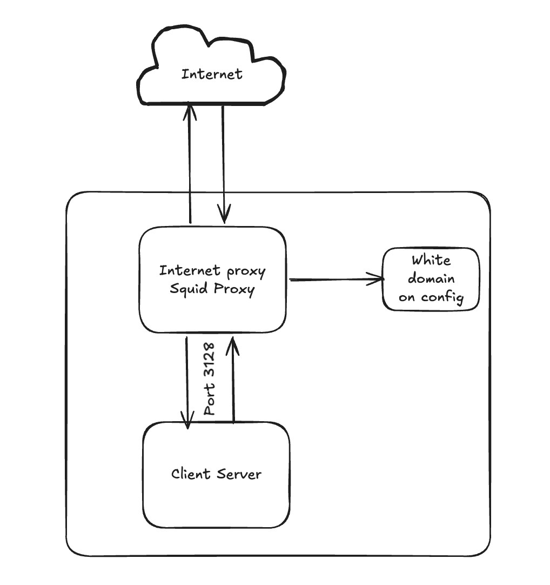

# Topology

# Setup Internet porxy with Squid Proxy

# Install Squid Proxy
```bash
sudo apt update
sudo apt install squid -y
```

# Start and enable squid porxy service
```bash
sudo systemctl start squid
sudo systemctl enable squid
```

# Configure whitelist domain

create file whitelist.txt:
```bash
vi /etc/squid/whitelist.txt

# General
.github.com
.google.com

# Ubuntu
.archive.ubuntu.com
.security.ubuntu.com
.snapcraft.io
.cloudflare.com

# Docker
.docker.io
.registry-1.docker.io
.auth.docker.io
.production.cloudflare.docker.com
.r2.cloudflarestorage.com
```

# Configure Squid (squid.conf)
By default, the squid configuration is very long. We backup the original file, and then make new configuration that was cleaner and easy to read.

```bash
backup file
mv /etc/squid/squid.conf /etc/squid/squid.conf.backup

create new file configuration
vi /etc/squid/squid.conf
```
Input the configuration (adjust your internal segment ip address in acl internal_network )
```bash
# 1. Definisikan Network Internal Anda (Ubah sesuai subnet server internal)
acl internal_network src 10.0.0.0/24

# 2. Definisikan file Whitelist yang tadi dibuat
acl whitelist_domains dstdomain "/etc/squid/whitelist.txt"

# 3. Aturan SSL/HTTPS agar proxy bisa menangani port 443
acl SSL_ports port 443
acl Safe_ports port 80          # http
acl Safe_ports port 443         # https
acl CONNECT method CONNECT

# 4. Tolak akses ke port yang tidak aman (selain 80 dan 443)
http_access deny !Safe_ports
http_access deny CONNECT !SSL_ports

# 5. ATURAN UTAMA: Izinkan network internal HANYA ke domain di whitelist
http_access allow internal_network whitelist_domains

# 6. Tolak semua akses lainnya (Block everything else)
http_access deny all

# 7. Port yang digunakan oleh Squid
http_port 3128
```
